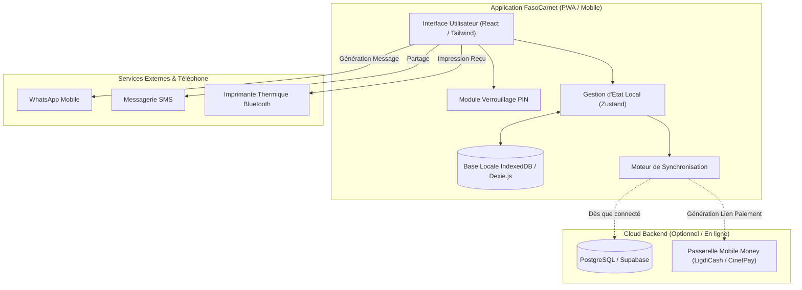

# Spécification Technique : FasoCarnet (Micro-SaaS Mobile de Gestion & Dettes Commerçants)

- **Date :** 2026-09-17
- **Statut :** Validé
- **Auteur(s) :** Maxime OUATTARA & Antigravity

---

## 1. Contexte & Objectifs

Au Burkina Faso et dans la sous-région ouest-africaine, le commerce de détail et de demi-gros repose massivement sur le secteur informel (boutiques, quincailleries, salons de coiffure, dépôts d'alimentation, prestataires). Les commerçants gèrent leurs flux et leurs dettes clients (« carnets de crédit ») sur du papier, ce qui provoque des pertes financières récurrentes, des contestations de créances et un manque de visibilité sur leur rentabilité.

**Objectifs de FasoCarnet :**
1. Fournir une application mobile / PWA ultra-légère, intuitive et fonctionnant **100% hors-ligne (Offline-First)**.
2. Permettre la saisie d'une vente en moins de 5 secondes via un pavé numérique direct.
3. Rendre le recouvrement des dettes clients indolore et professionnel grâce aux relances automatisées pré-formatées sur **WhatsApp** et **SMS**.
4. Émettre instantanément des reçus numériques partageables par WhatsApp.
5. Offrir un tableau de bord journalier synthétique pour savoir exactement ce qui a été encaissé (Cash, Orange Money, Moov Money, Wave) et ce qui reste dû.

---

## 2. Exigences Fonctionnelles

### Module 1 : Enregistrement des Ventes (Caisse Éclair)
- **EF-01 (Pavé numérique direct) :** L'écran d'accueil présente une calculatrice / pavé numérique tactile pour saisir un montant immédiatement sans obligation de créer un catalogue d'articles.
- **EF-02 (Modes de règlement) :** Support des modes de paiement : *Espèces (Cash)*, *Orange Money*, *Moov Money*, *Wave*, et *À Crédit*.
- **EF-03 (Calcul de monnaie rendu) :** Calcul instantané de la monnaie à rendre lorsque le client donne un billet supérieur au montant.
- **EF-04 (Catalogue rapide optionnel) :** Possibilité d'ajouter des articles favoris ou fréquents pour une sélection en 1 clic.

### Module 2 : Carnet de Dettes & Recouvrement
- **EF-05 (Fiche Client & Encours) :** Chaque client dispose d'un nom, numéro de téléphone, historique des crédits accordés et solde total restant dû.
- **EF-06 (Relance WhatsApp 1-Clic) :** Génération automatique d'un message WhatsApp personnalisé et poli avec le solde exact et les coordonnées de paiement du commerçant.
- **EF-07 (Enregistrement des règlements partiels) :** Possibilité d'enregistrer des acomptes (ex: paiement de 5 000 FCFA sur une dette de 15 000 FCFA) avec mise à jour immédiate du solde et reçu de versement.

### Module 3 : Reçus Numériques & Facturation Légère
- **EF-08 (Génération de reçu) :** Création instantanée d'un reçu numérique stylisé (texte structuré ou image/PDF léger) mentionnant : nom de la boutique, date/heure, articles/montants, mode de règlement.
- **EF-09 (Partage instantané) :** Bouton de partage natif vers WhatsApp, SMS ou impression Bluetooth (imprimante thermique de caisse ESC/POS).

### Module 4 : Bilan Journalier & Rapports
- **EF-10 (Bilan du jour) :** Synthèse quotidienne accessible en un coup d'œil :
  - Total des ventes encaissées ventilées par mode de paiement (Cash, OM, Moov, Wave).
  - Total des crédits accordés dans la journée.
  - Total des remboursements de dettes perçus.
- **EF-11 (Fermeture de caisse) :** Résumé téléchargeable ou partageable en fin de journée.

### Module 5 : Sécurité & Synchronisation
- **EF-12 (Mode Offline-First) :** Toutes les opérations de lecture et d'écriture s'effectuent en local (IndexedDB) sans nécessiter de connexion Internet.
- **EF-13 (Synchronisation Cloud) :** Synchronisation automatique et transparente dès qu'une connexion Internet est détectée.
- **EF-14 (Verrouillage par code PIN) :** Protection de l'application par un code PIN à 4 chiffres pour éviter l'accès non autorisé aux chiffres de la boutique.

---

## 3. Architecture & Choix Techniques

### Approche Retenue : PWA Offline-First (React + Tailwind CSS + Dexie.js / IndexedDB)
* **Frontend :** React (Vite) + TypeScript + Tailwind CSS (UI moderne, accessible sur mobile, compatible PWA installable sur l'écran d'accueil sans passer par le store, transformable en APK Android via Capacitor).
* **Base de Données Locale :** IndexedDB encapsulé avec **Dexie.js** (performant, persistant, 0 latence).
* **Backend & Synchronisation :** Supabase (PostgreSQL + Auth + Row Level Security) ou API REST Node.js légère.
* **Intégration WhatsApp :** Protocole URI `https://wa.me/<numero>?text=<message>` pour une ouverture directe et sans coût de l'application WhatsApp installée sur le terminal.

### Diagramme d'Architecture



---

## 4. Modèle de Données (Schema Local & Sync)

```typescript
// Entité Commerçant / Paramètres Boutique
interface ShopProfile {
  id: string;
  name: string;
  phone: string;
  address?: string;
  currency: string; // 'XOF' (FCFA)
  pinCodeHash: string;
  orangeMoneyNumber?: string;
  moovMoneyNumber?: string;
  waveNumber?: string;
  createdAt: string;
}

// Entité Client
interface Customer {
  id: string;
  name: string;
  phone: string;
  notes?: string;
  totalDebt: number;
  createdAt: string;
  updatedAt: string;
}

// Entité Vente
interface Sale {
  id: string;
  totalAmount: number;
  paymentMethod: 'CASH' | 'ORANGE_MONEY' | 'MOOV_MONEY' | 'WAVE' | 'CREDIT';
  isCredit: boolean;
  customerId?: string; // Requis si isCredit = true
  items?: { description: string; quantity: number; unitPrice: number }[];
  receivedAmount?: number;
  changeAmount?: number;
  createdAt: string;
  synced: boolean;
}

// Entité Dette & Remboursement
interface DebtRecord {
  id: string;
  customerId: string;
  saleId?: string;
  initialAmount: number;
  remainingAmount: number;
  dueDate?: string;
  status: 'PENDING' | 'PARTIAL' | 'PAID';
  createdAt: string;
}

interface PaymentTransaction {
  id: string;
  debtId: string;
  customerId: string;
  amount: number;
  paymentMethod: 'CASH' | 'ORANGE_MONEY' | 'MOOV_MONEY' | 'WAVE';
  createdAt: string;
}
```

---

## 5. Contraintes Globales & Ergonomie

1. **Légèreté & Vitesse :** L'application doit peser moins de 3 Mo au chargement initial et s'ouvrir en moins de 1 seconde.
2. **Accessibilité :** 
   - Gros boutons tactiles adaptés aux doigts (taille minimale 48px).
   - Contraste élevé (fond blanc / éléments bien contrastés) pour une lisibilité parfaite sous le soleil en extérieur.
   - Textes clairs et épurés, compréhensibles par des commerçants de tous niveaux scolaires.
3. **Monnaie par défaut :** FCFA (XOF) avec séparateur de milliers lisible (ex: `15 000 FCFA`).

---

## 6. Critères de Succès & Recette du MVP

- [ ] L'application s'installe en tant que PWA sur smartphone Android / iOS.
- [ ] Enregistrement d'une vente en espèces en moins de 5 secondes avec calcul automatique de la monnaie.
- [ ] Enregistrement d'une vente à crédit affectée à un client existant ou nouveau.
- [ ] Génération et ouverture d'un message WhatsApp de relance pré-rempli au clic sur le bouton « Relancer ».
- [ ] Enregistrement d'un acompte partiel avec mise à jour instantanée du solde de dette restant.
- [ ] Affichage du rapport journalier précis ventilant les encaissements par mode de paiement.
- [ ] Fonctionnement complet vérifié en mode avion (100% hors ligne).
- [ ] Verrouillage et déverrouillage par code PIN à 4 chiffres fonctionnels.
