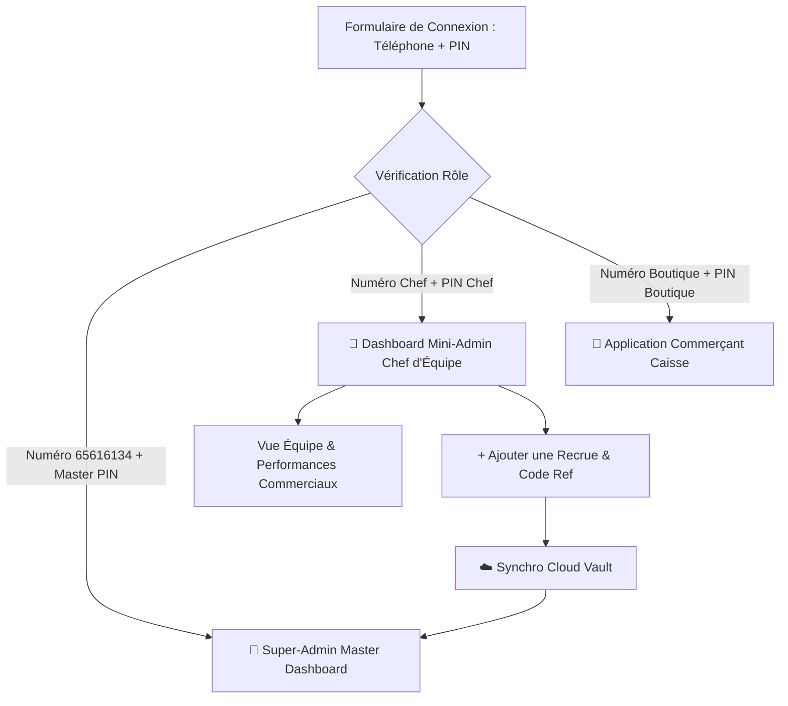

# Spécification Technique : Espace Mini-Administrateur (Chefs d'Équipe) & Gestion des Recrues

- **Date :** 2026-09-30
- **Statut :** Validé
- **Auteur(s) :** Maxime OUATTARA & Antigravity

---

## 1. Contexte & Objectifs

FasoCarnet déploie des équipes commerciales sur le terrain réparties par zones (ex: Ouagadougou, Bobo-Dioulasso, Koudougou, etc.). Chaque équipe est pilotée par un **Chef d'équipe (Mini-Administrateur)**.

### Objectifs clés :
1. **Délégation d'encadrement :** Permettre aux Chefs d'équipe d'accéder à un espace dédié pour suivre les performances individuelles de leurs commerciaux et intégrer directement de nouvelles recrues.
2. **Génération instantanée de codes d'affiliation :** Le chef d'équipe peut générer le code commercial unique (ex: `ALI226`, `MOUSSA7`) et partager immédiatement le kit d'onboarding via WhatsApp.
3. **Connexion unique & intelligente (Option A) :** Un seul écran de connexion (`Téléphone + PIN`). Le système détecte automatiquement si l'utilisateur est le **Super-Admin**, un **Chef d'équipe (Mini-Admin)** ou un **Commerçant**.
4. **Cloisonnement & Sécurité :** Le chef d'équipe n'a accès qu'à son équipe et aux commissions individuelles de ses commerciaux (pas d'accès aux finances globales ni aux autres équipes).
5. **Synchronisation Cloud bidirectionnelle :** Les recrues et équipes créées par les chefs d'équipe sont instantanément synchronisées avec le coffre Cloud (`_admin_vault` / Supabase) et visibles par le Super-Admin.

---

## 2. Exigences Fonctionnelles

### EF-01 : Création & Gestion des comptes Chefs d'équipe par le Super-Admin
- Le Super-Admin dispose dans l'onglet **« Équipes & Commerciaux »** d'un module de gestion des Chefs d'équipe.
- Champs d'un compte Chef d'équipe (`TeamLeaderAccount`) :
  - `id`: Identifiant unique (`leader_xxx`).
  - `fullName`: Nom et prénom du chef d'équipe.
  - `phone`: Numéro de téléphone WhatsApp (8 chiffres burkinabè).
  - `pinCodeHash`: Code PIN d'accès sécurisé (hachage SHA-256 avec sel).
  - `teamId`: Équipe commerciale rattachée.
  - `teamName`: Nom de l'équipe commerciale.
  - `zone`: Zone géographique assignée.
  - `status`: `'active'` | `'inactive'`.
- Possibilité pour le Super-Admin d'activer/désactiver un compte chef ou de modifier son PIN.

### EF-02 : Authentification Unifiée Intelligente
- Sur l'écran de connexion standard :
  - Si `phone` + `pin` correspondent au Super-Admin (`65616134`) ➔ Ouverture du **Super-Admin Master**.
  - Si `phone` + `pin` correspondent à un `TeamLeaderAccount` actif ➔ Ouverture directe du **Dashboard Mini-Admin (Chef d'équipe)**.
  - Sinon ➔ Tentative de connexion boutique commerçante standard.

### EF-03 : Tableau de bord Mini-Admin (Chef d'équipe)
- Interface épurée et optimisée pour mobile :
  - En-tête avec badge équipe, nom du chef et bouton de déconnexion.
  - Cartes KPI de l'équipe :
    - Nombre de commerciaux actifs dans l'équipe.
    - Nombre total de boutiques recrutées par l'équipe.
    - Nombre d'abonnements payants actifs.
    - Montant total des commissions dues aux commerciaux de l'équipe pour la semaine en cours.
  - Liste détaillée des commerciaux de son équipe avec :
    - Nom, téléphone, code d'affiliation.
    - Nombre de boutiques recrutées, CA généré, commissions de la semaine.
    - Bouton d'action WhatsApp pour renvoyer le pack commercial.

### EF-04 : Ajout de nouvelles recrues par le Chef d'équipe
- Modal / formulaire rapide d'ajout de recrue :
  - Nom complet du commercial.
  - Numéro de téléphone (WhatsApp).
  - Zone d'intervention.
  - **Génération automatique du code d'affiliation unique** (format conventionnel `PRENOM226` ou initiales).
  - Validation et enregistrement automatique dans l'équipe du chef.
  - Déclenchement en 1 clic de l'envoi WhatsApp du kit de bienvenue avec son lien d'affiliation (`?ref=CODE`).

### EF-05 : Synchronisation Cloud bidirectionnelle
- Toutes les créations / modifications de recrues et chefs d'équipe sont persistées dans Dexie IndexedDB local, `localStorage`, et sauvegardées en direct dans `_admin_vault` sur le Cloud distant.
- Le Super-Admin voit en temps réel les recrues ajoutées par les différents chefs d'équipe.

---

## 3. Architecture & Choix Techniques

### Schéma de données

```mermaid
classDiagram
    class SuperAdmin {
        +String phone "65616134"
        +String pinHash
        +manageAllTeams()
        +manageTeamLeaders()
        +viewGlobalStats()
    }

    class TeamLeaderAccount {
        +String id
        +String fullName
        +String phone
        +String pinCodeHash
        +String teamId
        +String teamName
        +String zone
        +String status
        +String createdAt
    }

    class CommercialTeam {
        +String id
        +String name
        +String leaderName
        +String leaderPhone
        +String leaderId
        +String zone
        +String[] affiliateCodes
    }

    class CommercialAgent {
        +String id
        +String code
        +String fullName
        +String phone
        +String teamId
        +String teamName
        +String status
    }

    SuperAdmin --> TeamLeaderAccount : Crée et Gère
    TeamLeaderAccount --> CommercialTeam : Dirige (1:1)
    CommercialTeam o-- CommercialAgent : Contient (1:N)
    TeamLeaderAccount --> CommercialAgent : Recrute & suit
```

### Schéma de flux d'authentification et d'accès



---

## 4. Composants & Fichiers impactés

1. **`src/types/index.ts`** :
   - Ajout de l'interface `TeamLeaderAccount`.
   - Ajout du champ `leaderId?: string` dans `CommercialTeam`.
2. **`src/db/services/adminService.ts`** :
   - Méthodes CRUD pour les comptes Chefs d'équipe : `getAllTeamLeaders()`, `saveTeamLeader()`, `deleteTeamLeader()`, `verifyTeamLeaderCredentials()`.
   - Méthode de récupération de l'équipe et des agents filtrés pour un chef d'équipe : `getTeamLeaderDashboardData(leaderId)`.
3. **`src/store/appStore.ts`** :
   - État `activeTeamLeader: TeamLeaderAccount | null`.
   - État `isMiniAdminOpen: boolean`.
   - Gestion de l'authentification unifiée dans `loginWithPhoneAndPin`.
4. **`src/components/admin/AdminDashboard.tsx`** :
   - Ajout de la sous-section de gestion des comptes Chefs d'équipe (création, édition PIN, suppression).
5. **`src/components/admin/MiniAdminDashboard.tsx`** (Nouveau composant) :
   - Vue dédiée et responsive pour le chef d'équipe (KPI équipe, recrues, ajout de commercial avec auto-code, partage WhatsApp).
6. **`src/components/onboarding/OnboardingView.tsx`** & **`src/App.tsx`** :
   - Intégration de la détection et du rendu conditionnel de `MiniAdminDashboard`.

---

## 5. Critères de Succès & Recette

- [ ] Le Super-Admin peut créer un compte Chef d'équipe avec nom, téléphone, PIN et équipe.
- [ ] La connexion intelligente via l'écran principal connecte directement le chef d'équipe sur son espace dédié.
- [ ] Le chef d'équipe ne visualise que les membres et les statistiques de son équipe.
- [ ] Le chef d'équipe peut ajouter un nouveau commercial et générer automatiquement son code d'affiliation.
- [ ] Le chef d'équipe peut envoyer le pack d'onboarding par WhatsApp en 1 clic.
- [ ] Les nouvelles recrues s'affichent immédiatement dans le tableau de bord Super-Admin.
- [ ] 100% des tests unitaires et d'intégration passent avec succès.
- [ ] Le build de production est validé sans erreur.
